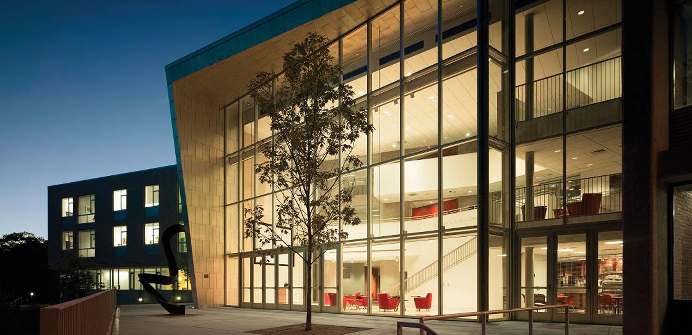
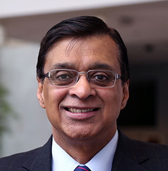
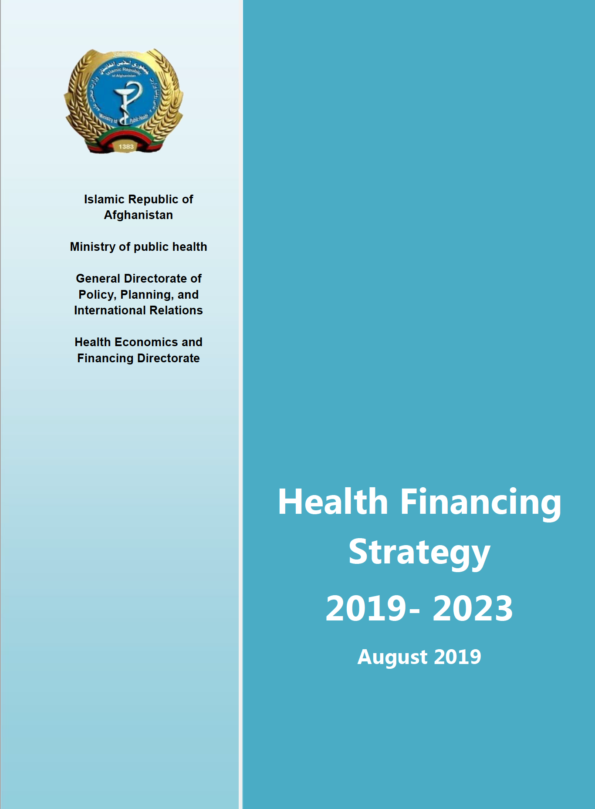

---
format:
  revealjs:
    theme: styles.scss
    transition: slide
    slide-number: true
    wide: true
    chalkboard: true
    margin: 0.1
    footer: "Georgetown University | Wu Zeng"
    controls: true
---

::: {.title-slide}

#  Jouney to Global Health

<br>
**Wu Zeng, MD, PHD, JD Candidate**
<br>

Georgetown University

:::

---

```{r setup, include=FALSE}
knitr::opts_chunk$set(echo = TRUE, warning = FALSE, message = FALSE)
library(tidyverse)
library(kableExtra)
library(readxl)
```

## Jourey on global health {visibility="hidden"}

<br>

<center> 

 

</center>

---

## Georgetown University {background-image="pic/gu.jpg" background-size="contain" background-position="right"}

:::: columns
:::{.column width="60%"}
- Founded: 1789 (oldest Catholic and Jesuit university in the U.S.)
- Location: Washington, DC
- US News Ranking: [#24]{.red} National Universities
- Top-ranked: Walsh School of Foreign Service, McDonough School of Business, Law Center
- Student Body: ~7,500 undergraduate / ~12,000 graduate
- Famous Alumni: President Bill Clinton, Bradley Cooper (actor), Madeleine Albright (former U.S. Secretary of State)
:::
:::{.column width="40%"}
:::
::::

---

## Broken dream 

:::: columns
:::{.column width="50%"}

<br>

<center>

 

<p class="caption"> What I wanted to be for college</p>

</center>

:::
:::{.column width="50%"}

<br>

<center>


<p class="caption"> What I ended to be for college</p>

</center>

:::
::::

---

## Field visit to Gansu, Qinghai, and Ningxia

:::: columns
:::{.column width="50%"}

<br>

<center>


</center>
:::

:::{.column width="50%"}

<br>

<center>


</center>

:::
::::

---

## Accessibility in remote areas

:::: columns
:::{.column width="50%"}

<center>


</center>
:::

:::{.column width="50%"}

<center>


</center>

:::
::::

---

## Beautiful places {visibility="hidden"}

:::: columns
:::{.column width="50%"}
<center>


</center>

:::
:::{.column width="50%"}

<center>


</br>

</br>


</center>

:::
::::

---

## Study at Heller School, Brandeis University

<center>




</center>

---

## Mentors 

:::: columns
:::{.column width="50%"}

<br>

<center>


Prof. Donald S. Shepard

</center>


:::

:::{.column width="50%"}

<br>

<center>


Prof. AK Nandakumar
</center>
:::
::::


---

## Key Research Area 1: Health systems financing

:::: columns
:::{.column width="50%"}

- [Health Policy Project (HPP)]{.red} in Afghanistan, USAID: Senior Health Economist
    - Lead overall HEF activities
    - Build local capacity
- [Health Sector Resiliency (HSR) project]{.red} in Afghanistan, USAID: Senior Advisor
    - Supervise overall health economic and financing activities
- Technical assistance on [health financing]{.red} in Zimbabwe, The World Bank
    - Led national health accounts
    - Supervise costing national health strategy

:::
:::{.column width="50%"}

<center> 

</center>
:::
::::

---

## Key Research Area 2: Economics Evaluation

:::: columns
:::{.column width="50%"}

- [Costing]{.red}: Costing essential package of services (EPS) in Bangladesh, USAID

- [Cost-efficiency]{.red}: Economic analysis of HIV/AIDS programs, UNAIDS

- [Cost-effectiveness]{.red}: Cost-effectiveness analysis of results-based financing in Zambia and Zimbabwe, World Bank

- [Economic burden of disease]{.red}: Economic burden of dengue, Sanofi Pasteur
:::
:::{.column width="50%"}

<center>


</center>
:::
::::

---

## Key Research Area 3: Policy/program design and evaluation 

::: columns
:::{.column width="50%"}

- [Various health policy]{.red} in Afghansitan, USAID

- [Financing strategy for health emergencies]{.red} in Bhutan, UNICEF

- [Evaluation of performance-based financing]{.red} in the Republic of the Congo, The World Bank
    - Lead both two rounds of household surveys (∼1400 households) and health facility surveys (∼300 health facilities)
- Evaluation of lifestyle modification and cardiac rehabilitation in Medicare beneficiaries, Centers for Medicare & Medicaid Services.
    - Lead the analysis of impact evaluation using claims data from Medicare
:::
:::{.column width="50%"}
<center>

</center>
:::

<center> 

### Evaluation is important $\rightarrow$ policy change

</center>

::::

---

## Do not need to be a pilot to travel around the world

:::: columns
:::{.column width="50%"}

<center> 


</center>

:::
:::{.column width="50%"}

<center>


</center>
:::
::::

---

## Rewarding experience from global health

:::: columns
:::{.column width="50%"}
<center>


</center>

:::
:::{.column width="50%"}

<center>


</center>

:::
::::

---

## Current work

:::: columns
:::{.column width="50%"}

- [Resource tracking]{.red} in Afghansitan and Somalia, World Bank
- [Cost estimate]{.red} for anxillary services for oncology treatment, ASCO
- [Economic evaluation]{.red} of Ebola response in DRC, World Bank
- [Economic evaluation]{.red} of interventions addressing cervical cancer, GAVI

:::
:::{.column width="50%"}

<center>


</center>

:::
::::

--- 

## Takeaways

::: {.incremental}

- It takes time to find your passion
- Being perserverant in pursuing your passion
- Being open-minded and flexible
- Global health remains new and evolving with many opportunities
- Global health is a rewarding field to make an impact

:::

---

## Q&A

<br><br>

<center> 

`r fontawesome::fa("envelope")` <a href="mailto:wz192@georgetown.edu">wz192@georgetown.edu</a>

</center>


